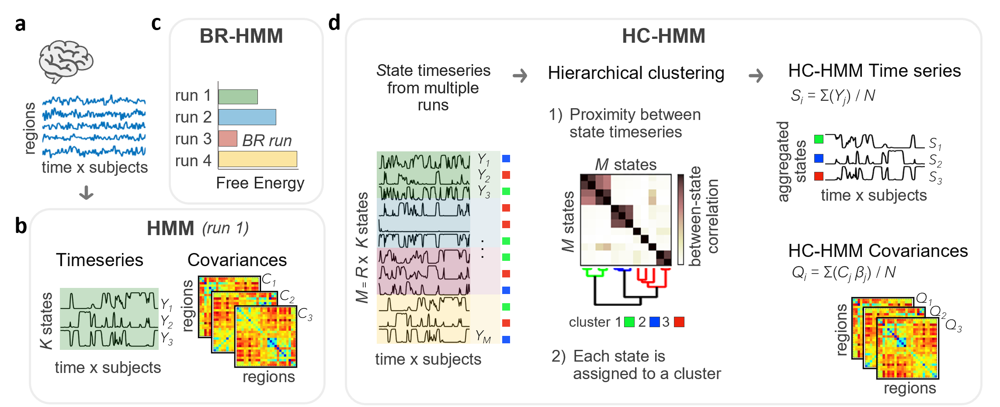

# reproducibleHMM

Code used in Alonso and Vidaurre (2023) "Stability of dynamic FC estimates in neuroimaging and electrophysiology: solutions and limits"

## Summary

The research investigates the stability of dynamic functional connectivity (FC) estimates obtained from a Hidden Markov Model (HMM) in the field of neuroimaging and electrophysiology. The study explores two approaches and their limitations in estimating FC patterns over time.

- best-ranked HMM (BR-HMM), involves running the inference multiple times and selecting the best model based on a quantitative measure combining fitness and model complexity.
- hierarchical clustered HMM (HC-HMM), generates stable aggregated state timeseries by applying hierarchical clustering to the state timeseries obtained from multiple runs.

---
**Figure 1:** Graphical summary of two approaches (BR-HMM and HC-HMM) to achieve reliable patterns of time-varying FC.

a) preprocessed fMRI or MEG timeseries, temporally concatenated across subjects.
b) An HMM with K states inferred from the concatenated brain timeseries to obtain patterns of time-varying FC (i.e., covariance matrices across regions). The state timeseries contain the probability of a given state to be active at each time point.
c) BR-HMM approach consists of running the model inference multiple times, each starting from a different random initialization, and selecting the best-ranked HMM run according to the free energy, which is a quantitative measure that weighs the fitness of the data and simplicity of the model.
d) HC-HMM approach involves running the HMM multiple times (R) and clustering the resulting state timeseries (M=R×K) according to their Pearson’s correlation to obtain more stable time-varying FC estimates. Ward's hierarchical clustering algorithm is then applied to the M×M between-state correlation matrix to find similar state clusters. By averaging the original HMM state timeseries within each cluster, a set of aggregated state timeseries are produced. The covariances of each aggregated state are calculated by computing the weighted average of the covariance matrices of the original states within each cluster. The weight assigned to each original state corresponds to its fractional occupancy, which represents the average probability of the state activation throughout the dataset.

BR-HMM: Best-ranked HMM; HC-HMM: Hierarchical-clustered HMM; HMM: hidden Markov model(ling).

---

## Requirements

- This script requires the HMM-MAR toolbox, available at [https://github.com/OHBA-analysis/HMM-MAR](https://github.com/OHBA-analysis/HMM-MAR).

## Usage

This script assumes that all the preprocessing has been done and provides the main pipeline for analyzing the time series data.

### Input

- `X`: Observations; 1xN cell containing the time series per subject.
- `T`: Length of time series; 1xN cell containing the lengths of the time series.

## Contact

For any inquiries or issues, please contact Sonsoles Alonso at Aarhus University.
